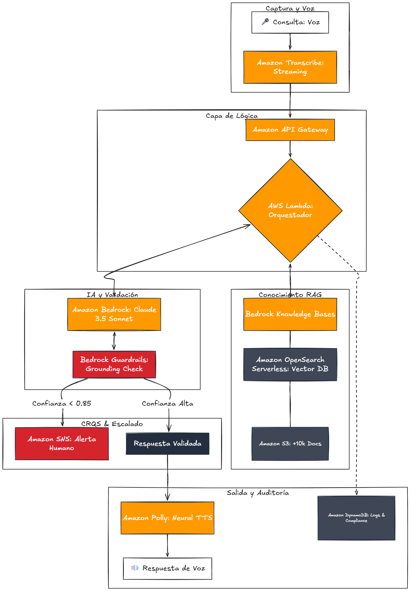

# Memoria Técnica: Asistente Smart Home con IA Híbrida (NLU + RAG)

## 1. Introducción y Caso de Uso
Este proyecto presenta un **Asistente de Voz Inteligente** diseñado para el soporte técnico de ecosistemas Smart Home. La solución utiliza un **Modelo Híbrido** que combina la robustez de la NLU tradicional de **Dialogflow ES** con la flexibilidad de la IA Generativa mediante **RAG**.

### Público Objetivo
El sistema está dirigido a usuarios domésticos de dispositivos Smart Home (bombillas, termostatos, cámaras) que buscan una asistencia técnica inmediata y natural, sin necesidad de navegar por menús complejos o manuales extensos.

### Justificación Tecnológica
- **Dialogflow ES:** Elegido por su estabilidad en la gestión de **Contextos** y **Slot Filling**, fundamental para procesos transaccionales seguros.
- **FastAPI:** Proporciona un backend asíncrono de alto rendimiento para gestionar los webhooks y las llamadas a los LLMs con latencia mínima.
- **ChromaDB + HuggingFace Local:** Se optó por una base de datos vectorial local y el modelo `all-MiniLM-L6-v2` para garantizar la privacidad de los datos y eliminar la dependencia de APIs externas para embeddings.
- **Gemini 1.5 Flash-lite:** Seleccionado específicamente por su velocidad de inferencia, crucial para mantener una conversación de voz fluida y evitar el timeout de 5s de Dialogflow.

---

## 2. Diagrama Arquitectónico
La arquitectura se basa en un flujo de datos que integra servicios de nube (Azure/GCP) con un backend local de alta velocidad.

---

## 3. Servicios de Voz (Bloque B - Independencia Total)

En estricto cumplimiento de los requisitos de diseño, el sistema implementa una **integración externa de voz** totalmente desacoplada del motor nativo de Dialogflow:

- **Speech-to-Text (STT):** El cliente captura el audio localmente y utiliza **Azure Cognitive Services** para la transcripción en tiempo real con alta precisión.
- **Text-to-Speech (TTS):** La síntesis de respuestas emplea la voz neuronal `es-ES-ElviraNeural` de **Azure Speech Services**, asegurando una prosodia natural y conversacional.

> **Nota Arquitectónica:** No se utilizan las funciones nativas de voz de Dialogflow para garantizar la flexibilidad del ecosistema y cumplir con la exigencia de integración de servicios externos.

---

## 4. Flujo de Conversación y Gestión de Contextos

El sistema utiliza **Contextos de Salida** para gestionar conversaciones multi-turno complejas. Un ejemplo crítico es el flujo de vinculación o reporte de incidencias:

1. El usuario inicia una acción (ej: *"Quiero reportar un fallo"*).
2. Dialogflow activa el contexto de sesión `esperando_id`.
3. Durante la vigencia de este contexto, el sistema prioriza algorítmicamente la captura de la entidad `@id_dispositivo`.
4. El árbol de diálogo solo avanza cuando el *slot* es validado, garantizando la integridad de la intención original.

---

## 5. Validación por Regex y Seguridad Transaccional

Para garantizar la integridad de los datos técnicos inyectados en el sistema, se implementan entidades con validación estricta basada en **Expresiones Regulares (Regex)**:

- **`@id_dispositivo`:** Definida como `\d{6}`. Obliga al usuario a proporcionar exactamente 6 dígitos numéricos, mitigando errores de transcripción STT durante el emparejamiento de hardware.
- **`@ticket_id`:** Definida como `TK-\d{4}`. Asegura que el seguimiento de incidencias cumpla sistemáticamente con el estándar corporativo.

---

## 6. Pipeline RAG (Retrieval-Augmented Generation)

La capacidad de resolución técnica autónoma recae sobre un pipeline RAG estructurado en cuatro fases:

1. **OCR Avanzado:** Uso de **Azure Document Intelligence** para la extracción estructurada de texto desde manuales PDF complejos (interpretación de tablas y columnas).
2. **Vectorización Local:** Los textos se fragmentan (*chunking*) en bloques de 500 caracteres y se vectorizan con el modelo local `all-MiniLM-L6-v2`.
3. **Búsqueda Semántica:** **ChromaDB** actúa como base de conocimiento, recuperando en milisegundos los *chunks* más relevantes.
4. **Generación con LLM:** **Gemini 1.5 Flash-lite** recibe el contexto y sintetiza una respuesta técnica breve, diseñada acústicamente para ser reproducida por el motor TTS.

### 6.1. Gestión de Alucinaciones (Safety Guard)

Para asegurar la robustez de las respuestas técnicas, se implementa un filtro de calidad estricto:

- **Restricción de Contexto:** El *System Prompt* fuerza al LLM a derivar su respuesta **exclusivamente** de los fragmentos recuperados en ChromaDB.
- **Respuesta de Fallback Seguro:** Si la distancia vectorial no aporta información concluyente, el modelo retorna por defecto: *"Lo siento, no he encontrado instrucciones específicas para ese equipo en los manuales"*, impidiendo la generación de instrucciones técnicas potencialmente destructivas.

---

## 7. Matriz de Casos de Prueba (QA)

A continuación, se detalla la batería de pruebas de certificación ejecutadas sobre el sistema:

### 7.1. Bloque: Consultas Técnicas RAG

| Test ID | Escenario de Prueba | Input del Usuario | Resultado Esperado Validado |
| :--- | :--- | :--- | :--- |
| **TC-3.1** | Selección de Menú | *"Manual de usuario"* | El bot despliega el menú numérico (1-5) correctamente. |
| **TC-3.2** | Consulta RAG | *"La 2 (EZVIZ)"* | Extrae y sintetiza instrucciones de la cerradura EZVIZ. |
| **TC-3.3** | Cache Hit | Repetir *"La 2"* | Respuesta instantánea (<100ms) servida desde caché. |

### 7.2. Bloque: Flujos Transaccionales

| Test ID | Escenario de Prueba | Input del Usuario | Resultado Esperado Validado |
| :--- | :--- | :--- | :--- |
| **TC-4.1** | Slot Filling | *"Quiero vincular"* | El bot retiene el contexto y solicita el ID de 6 dígitos. |
| **TC-4.2** | Validación Regex | *"Es el 123456"* | ID capturado, validado por regex y vinculación completada. |
| **TC-8.1** | Follow-up Seguro | *"Resetear"* → *"Sí"* | Confirmación de acción crítica tras doble verificación explícita. |

---

## 8. Conclusión

La solución implementada demuestra empíricamente cómo la orquestación de servicios cognitivos de voz, NLU transaccional (Dialogflow ES) y modelos de lenguaje modernos (FastAPI + Gemini) transforma el soporte técnico clásico. Se logra una experiencia conversacional fluida, precisa y altamente escalable, mitigando el riesgo de alucinación mediante un pipeline RAG local y seguro.

---

