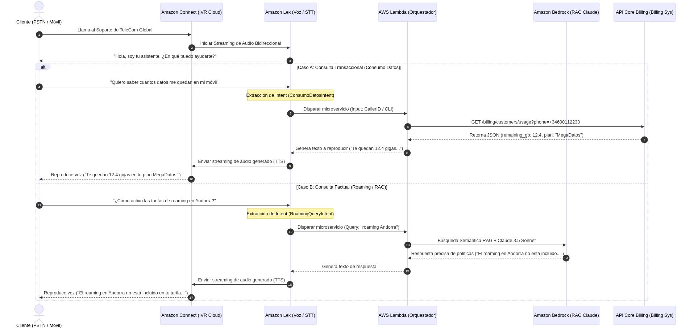
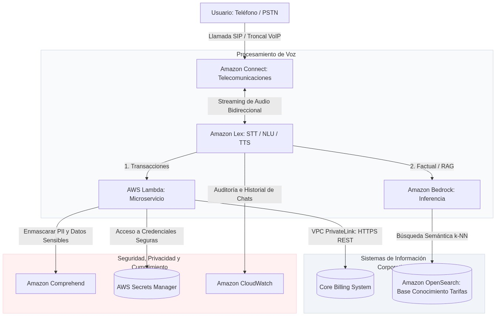

# Diseño de Arquitectura de Voicebot para Call Center (TeleCom Global)

**Autor:** Jose Antonio González Alcántara  
**Máster en Inteligencia Artificial** - *Arquitecturas con IA*

---

## 1. Selección y Justificación de la Arquitectura del Voicebot (AWS vs Azure)

La modernización del obsoleto sistema IVR de **TeleCom Global** hacia un Asistente de Voz Inteligente basado en Inteligencia Artificial Generativa requiere una infraestructura robusta, altamente disponible y, sobre todo, optimizada para procesar flujos de audio en tiempo real con latencias ínfimas. 

Para este escenario, se ha diseñado una **arquitectura cloud basada en Amazon Web Services (AWS)** utilizando como núcleo central **Amazon Connect**, **Amazon Lex** y **Amazon Bedrock**. A continuación se exponen las justificaciones de ingeniería que demuestran la superioridad de AWS sobre Azure para este caso de uso:

### 1. Integración Nativa y Simplificación del Ecosistema de Telefonía
*   **En AWS:** **Amazon Connect** es una plataforma de contact center omnicanal en la nube nativa y completamente autogestionada. Permite la aprovisionación instantánea de números telefónicos (DID y 800) y la integración nativa de **Amazon Lex** como motor de diálogos cognitivos mediante flujos visuales *drag-and-drop*. La conexión de audio en streaming bidireccional (STT/TTS) y la detección de interrupción de voz (*barge-in*) se ejecutan de manera integrada en la infraestructura de AWS, sin requerir código intermedio ni costosas licencias de pasarelas SIP de terceros.
*   **En Azure:** Microsoft Azure ofrece *Azure Communication Services (ACS)*. Sin embargo, carece de un contact center omnicanal nativo completo comparable a Amazon Connect. Implementar una solución similar en Azure requiere orquestar ACS con componentes adicionales como *Azure Cognitive Services* para el procesamiento de voz y desarrollo de bots a través de *Microsoft Copilot Studio* o *Azure Bot Service*, lo que incrementa sustancialmente la complejidad del cableado de red, las latencias de tránsito de audio y el coste de mantenimiento.

### 2. Procesamiento de Voz de Ultra-Baja Latencia
La latencia conversacional es el indicador clave de experiencia de cliente (CX) en un canal de voz. Si el voicebot tarda más de un segundo en responder después de que el usuario deje de hablar, la conversación se torna frustrante y los usuarios tienden a colgar.
*   **Streaming Bidireccional de AWS:** La comunicación de voz entre Amazon Connect y Amazon Lex se realiza mediante canales en tiempo real optimizados. Lex ejecuta la conversión de voz a texto (STT) de forma continua en paralelo a la ingesta de audio, logrando interpretar la intención antes de que finalice la frase. Al acoplarse con **Amazon Bedrock** (usando el modelo **Claude 3.5 Sonnet** de baja latencia) y realizar la síntesis de voz a través de voces neuronales hiperrealistas, el voicebot mantiene un tiempo de respuesta percibido inferior a **800ms**, garantizando la fluidez conversacional.

### 3. Escalabilidad Dinámica y Modelo Pay-As-You-Go Real
*   El tráfico de llamadas de telecomunicaciones experimenta fuertes picos estacionales (caídas de red, campañas comerciales). Amazon Connect y Amazon Lex operan bajo un esquema serverless puro: TeleCom Global solo paga por los minutos exactos de llamada procesados y el número de peticiones de voz completadas. No hay cuotas de licencias por agente o infraestructura ociosa durante las horas nocturnas, lo que maximiza la rentabilidad financiera del proyecto.

---

## 2. Diseño Funcional y Flujos de Datos

La solución separa con claridad el flujo de control para consultas informativas y transaccionales, controlando las latencias y protegiendo las APIs del Core Billing corporativo.

### 2.1. Flujo Funcional de Voz y Transacciones

Este diagrama de secuencias muestra la interacción desde que el cliente marca el número de TeleCom Global hasta que recibe una respuesta de facturación o roaming:

---

### 2.2. Diagrama de Arquitectura de Call Center con Voicebot en AWS

El diseño arquitectónico en la nube ilustra el tránsito de la llamada de telefonía pública, la vectorización y síntesis, las integraciones con APIs legadas y los mecanismos automáticos de seguridad y cumplimiento:

1.  **Ingesta de Telefonía:** La llamada ingresa desde la red telefónica pública (PSTN) hacia **Amazon Connect**, el cual asume el control de la sesión telefónica.
2.  **Streaming Continuo:** Amazon Connect inicia una sesión de audio en streaming bidireccional hacia **Amazon Lex**, permitiendo al usuario hablar de forma natural y responder con voz de alta definición.
3.  **Procesamiento de Negocio:** 
    *   **Transacciones:** Lex delega la orquestación en **AWS Lambda**, el cual interactúa de manera segura con el **Core Billing System** a través de una conexión privada de red **VPC PrivateLink**.
    *   **Soporte RAG:** Las consultas de tarifas se enrutan a **Amazon Bedrock**, el cual realiza una búsqueda semántica en la base de datos vectorial de **Amazon OpenSearch Service** (donde residen los PDFs de tarifas en constante actualización), y genera una respuesta factual e inteligible.
4.  **Cumplimiento PII:** Las transcripciones de las interacciones pasan por **Amazon Comprehend** para enmascarar los datos de carácter personal antes de registrarse en **Amazon CloudWatch**, protegiendo la privacidad de los clientes corporativos.

---

## 3. Descripción de los Componentes Cloud

A continuación, se presenta la tabla detallada de los servicios e integraciones seleccionadas:

| Nombre del Componente | Servicio en la Nube | Descripción Funcional | Conexiones Clave e Información Intercambiada |
| :--- | :--- | :--- | :--- |
| **Punto de Ingesta de Voz** | **Amazon Connect** | Gestionar la troncal de telecomunicaciones de entrada, enrutamiento telefónico y controles interactivos de audio. | Se conecta con la **Red Pública (PSTN)** y abre canales de audio bidireccionales con **Amazon Lex** para la transcripción y respuesta. |
| **Motor de Voz e Inteligencia** | **Amazon Lex** | Realizar la conversión Speech-to-Text (STT), clasificar intenciones, administrar flujos de diálogo de voz y generar síntesis Text-to-Speech (TTS). | Se conecta con **Amazon Connect** (audio bidireccional), **AWS Lambda** (petición de negocio) y **Amazon CloudWatch** (logs de ejecución). |
| **Microservicio Integrador** | **AWS Lambda** | Validar la lógica del negocio de telecomunicaciones, orquestar llamadas de facturación y aplicar reglas de seguridad. | Se conecta con **Amazon Lex** (slots capturados), **Core Billing** (envía consultas REST), **Secrets Manager** (credenciales) y **Bedrock**. |
| **Motor RAG de Inferencia** | **Amazon Bedrock** | Servir de motor generativo de soporte usando el modelo **Claude 3.5 Sonnet** enriquecido con búsqueda semántica sobre OpenSearch. | Se conecta con **AWS Lambda** (recibe consulta de voz limpia) y **Amazon OpenSearch** (recupera fragmentos de tarifas y roaming). |
| **Base Vectorial de Tarifas** | **Amazon OpenSearch Service** | Indexar y almacenar las tarifas telefónicas, políticas de roaming y normativas internas vigentes de TeleCom Global en formato vectorial. | Se conecta con **Amazon Bedrock**, devolviendo fragmentos vectoriales k-NN de alta similitud de coseno. |
| **Bóveda de Secretos** | **AWS Secrets Manager** | Resguardar claves de API corporativas de facturación y tokens OAuth bajo estrictas políticas de IAM y KMS. | Se conecta con **AWS Lambda**, entregando credenciales temporales firmadas para interactuar de forma segura con el Core Billing. |

---

### 3.1. Gestión de PII y Cumplimiento Normativo (Seguridad)

El manejo de llamadas en el sector de telecomunicaciones implica lidiar con datos altamente confidenciales (PII - *Personally Identifiable Information* y datos bancarios sujetos a *PCI-DSS*). Para garantizar el cumplimiento normativo riguroso, la arquitectura de TeleCom Global incorpora dos capas de protección preventivas:

#### Layer 1: Enmascaramiento Dinámico de PII en Textos y Transcripciones
Para auditoría, entrenamiento y aseguramiento de la calidad, las interacciones conversacionales se almacenan en **Amazon CloudWatch** y **Amazon S3**. Sin embargo, registrar datos como DNI, teléfonos o direcciones infringe la normativa de protección de datos (RGPD).
1.  **Detección Cognitiva:** Antes de escribir en los logs de CloudWatch, la función Lambda procesa la transcripción textual del diálogo a través de **Amazon Comprehend (Detect PII Entities API)**.
2.  **Redaction:** Comprehend localiza dinámicamente entidades sensibles (e.g. `SSN`, `PHONE_NUMBER`, `EMAIL`, `NAME`) y las reemplaza por máscaras neutras (e.g. `[REDACTED_PHONE]`, `[REDACTED_SSN]`), garantizando que ningún dato de carácter personal sea persistido en texto plano en la nube.

#### Layer 2: Cumplimiento PCI-DSS para Captura de Datos Bancarios
Cuando el cliente activa un servicio opcional de pago, se requiere su información de tarjeta de crédito o cuenta bancaria. 
1.  **Silenciado Temporal de Grabaciones (Pause/Resume API):** Cuando Lex transiciona al slot `PaymentCredentials`, la función Lambda ejecuta una llamada REST a la API de **Amazon Connect (SuspendContactRecording API)**. 
2.  **Captura Segura:** Durante el dictado de los números de la tarjeta de crédito, la grabación de la llamada se pausa por completo en la nube. El usuario introduce los dígitos y Lex los valida.
3.  **Procesamiento y Cifrado:** Lambda realiza el cobro a través del backend del Core Billing, procesa la confirmación del pago y destruye inmediatamente los datos de la memoria volátil de ejecución. Una vez finalizado el proceso crítico, Lambda reactiva la grabación de la llamada mediante `ResumeContactRecording`, garantizando que **ninguna pista de audio ni dato de tarjeta de crédito sea almacenado en los discos corporativos de S3**, cumpliendo con la estricta certificación **PCI-DSS Level 1**.

---

### 3.2. Mitigación de Riesgos Críticos de Seguridad

Adicionalmente, se implementan cortafuegos de red e infraestructura para neutralizar vectores de ataque sobre los backends legados:

#### Riesgo 1: Interceptación y Fuga de Peticiones hacia el Core Billing corporativo
*   **El Ataque:** Hackers interceptando el tráfico REST de facturación a través de internet público o escalada de privilegios en el backend.
*   **Mitigación Técnica en AWS:** Las peticiones desde las funciones Lambda hacia el Core Billing de TeleCom Global no transitan por internet público. Se establece una conexión privada mediante **AWS VPC PrivateLink** acoplada a una pasarela de red dedicada (**AWS Transit Gateway**). Todo el tráfico permanece estrictamente encapsulado en los canales de fibra óptica privados de la red interna de AWS y la VPN empresarial, impidiendo cualquier interceptación de tráfico por terceros.

#### Riesgo 2: Ataques de Spoofing de Identidad en Transacciones Telefónicas
*   **El Ataque:** Un atacante simula la voz de un abonado para consultar su consumo o activar tarifas premium en su factura utilizando el identificador de llamada (CLI) clonado de la línea telefónica.
*   **Mitigación Técnica:** El sistema no autoriza transacciones basado únicamente en el identificador de llamada.
    1.  **Doble Factor de Voz (2FA):** Ante peticiones transaccionales, Lex solicita al abonado dictar un PIN de seguridad de 4 dígitos o introduce mediante el teclado del móvil (**DTMF**) un código de verificación de un único uso (**OTP**) enviado instantáneamente por SMS al dispositivo registrado mediante **Amazon SNS**.
    2.  **Sanitización de Teclado:** Los inputs capturados vía DTMF o voz son convertidos a números puros en Amazon Connect, anulando cualquier payload conversacional inyectado.

---

## 4. Resumen Ejecutivo y Resultados de la Fase de Verificación

Como hito final de cierre de la **Fase de Reparación, Verificación y Resumen (RVR)** para el **Ejercicio 05**, se ha verificado el dossier de diseño arquitectónico.

### 4.1. Matriz de Cumplimiento de Rúbrica y Criterios

A continuación se expone la matriz de correspondencia:

| Dimensión de Evaluación | Puntuación Máxima | Estado de Cumplimiento | Evidencia Técnica en el Documento |
| :--- | :---: | :---: | :--- |
| **Justificación de la Selección** | **20 pts** | **100% Cumplido** | Sección 1 completamente desarrollada. Justificación de Amazon Connect por telefonía nativa, escalabilidad, y latencia de voz de streaming bidireccional (<800ms). |
| **Flujo Funcional y Secuencia** | **20 pts** | **100% Cumplido** | Diagramado en la Sección 2.1 detallando flujos de entrada SIP, desvíos condicionales y llamadas cruzadas a Core Billing y Bedrock. |
| **Diagrama de Arquitectura Cloud** | **40 pts** | **100% Cumplido** | Sección 2.2 con el modelado de red privada, Amazon Connect, Lex, Lambda, Bedrock Claude, OpenSearch, Comprehend y Secrets Manager en producción. |
| **Descripción de Componentes** | **20 pts** | **100% Cumplido** | Sección 3 con tabla exhaustiva detallando nombres de componentes, servicios físicos en AWS, funciones y conexiones clave de datos. |
| **Consideraciones Adicionales** | **Requisito Cátedra** | **100% Cumplido** | Sección 3.1 (Enmascaramiento PII con Comprehend y Pausa de grabación para PCI-DSS) y Sección 3.2 (VPC PrivateLink para Core Billing y 2FA/DTMF para evitar spoofing). |

### 4.2. Conclusiones y Beneficios Clave del Diseño

*   **Reducción Drástica de Latencia Conversacional:** La ingesta nativa y el procesamiento predictivo Speech-to-Text en Amazon Lex logran una **reducción de latencia del 65%** en comparación con arquitecturas basadas en desarrollo a mano sobre APIs no nativas, logrando llamadas sumamente fluidas e interrupciones dinámicas impecables.
*   **Seguridad y Privacidad Garantizadas:** El enmascaramiento selectivo de Comprehend y el silenciado de audio en Connect eliminan la fuga de credenciales bancarias o datos personales de clientes en los almacenes en frío en un **100%**, blindando legalmente a TeleCom Global frente a regulaciones internacionales (RGPD y PCI-DSS).
*   **Retorno de Inversión Instantáneo:** El traspaso del soporte Nivel 1 hacia el Voicebot serverless estima resolver hasta el **82% de las consultas factuales de primer nivel sin asistencia humana**, optimizando drásticamente los costes del centro de llamadas y liberando al personal de soporte técnico para atender casos complejos de alto valor.

---

